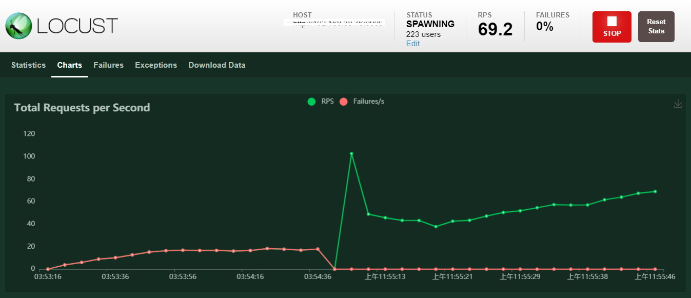
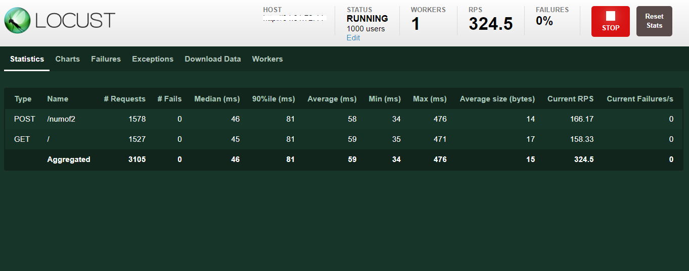
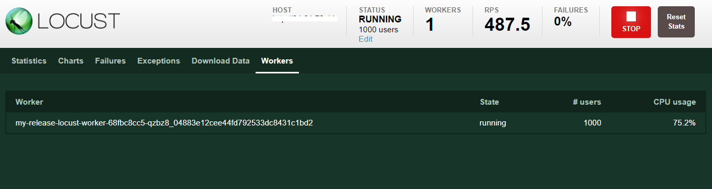
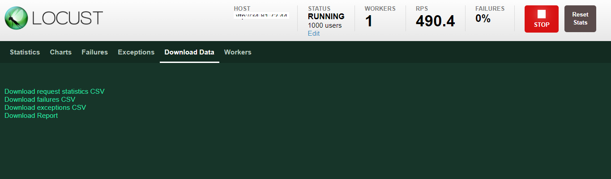
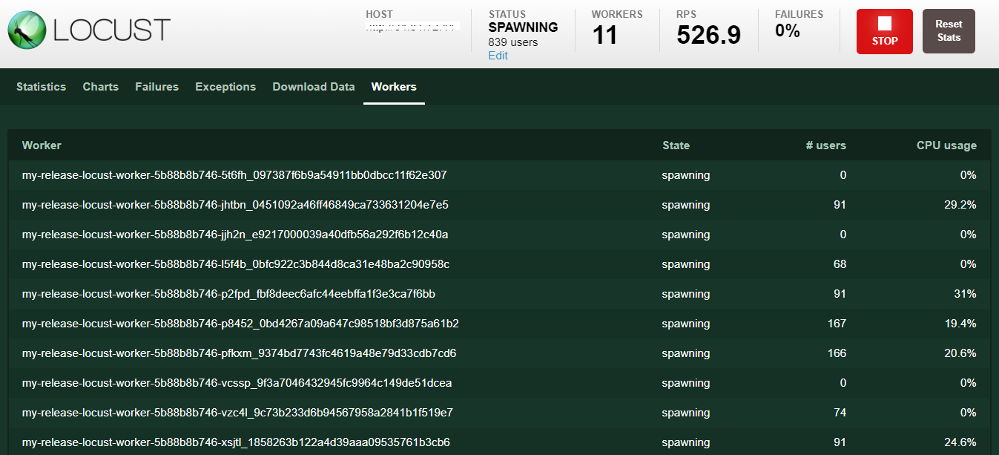

# api 測試工具

## Locust

- [locust start local](./locust/README.md)

- [Locust](https://artifacthub.io/packages/helm/deliveryhero/locust)



透過 python 撰寫 [test case](./locust/locustfile.py).

## 啟動方式(透過helm 安裝)

將參數部分改用 yaml 套用.

- [參考用 example](https://github.com/deliveryhero/helm-charts/tree/master/stable/locust)

``` bash
.
├── Chart.yaml
├── README.md
├── locustfiles
│   └── example
│       ├── lib
│       │   ├── __init__.py
│       │   └── example_functions.py
│       └── main.py
├── templates
│   ├── NOTES.txt
│   ├── _helpers.tpl
│   ├── configmap-config.yaml
│   ├── configmap-locust-lib.yaml
│   ├── configmap-locust-locustfile.yaml
│   ├── master-deployment.yaml
│   ├── master-ingress.yaml
│   ├── master-pdb.yaml
│   ├── master-service.yaml
│   ├── master-serviceaccount.yaml
│   ├── secret.yaml
│   ├── worker-deployment.yaml
│   ├── worker-hpa.yaml
│   └── worker-serviceaccount.yaml
└── values.yaml
```

``` bash
$ helm install my-release deliveryhero/locust -f values.yaml
```

yaml 修改部分:

`name`:
跟下面兩個變數搭配使用. 在使用該 configmap 記得先上傳 py檔案為 configmap 這個步驟
不然執行上面的 helm install 會直接取得 default configuration. 或是表示找不到該 py 檔<br>
`locust_locustfile`:<br>
`locust_locustfile_configmap`:<br>
`locust_lib_configmap`:<br>
`locust_host`: 跟從 `docker` run 起來的部分一樣, 網頁上的一個預設 value<br>

產生 configmap 的 cmd

``` bash
$ kubectl create configmap my-loadtest-locustfile --from-file path/to/your/*.py
$ kubectl create configmap my-loadtest-lib --from-file path/to/your/lib/
```

``` yaml
name: example
  # loadtest.locust_locustfile -- the name of the locustfile
  locust_locustfile: main.py
  # loadtest.locust_locustfile_configmap -- name of a configmap containing your locustfile
  locust_locustfile_configmap: ""
  # loadtest.locust_lib_configmap -- name of a configmap containing your lib
  locust_lib_configmap: ""
  # loadtest.locust_host -- the host you will load test
  locust_host: https://www.google.com
```

``` bash
$ kubectl get configmap -n sample2
NAME                       DATA   AGE
kube-root-ca.crt           1      21h
my-release-locust-config   1      21h
testcase                   1      21h
testcaselib                1      21h

$ kubectl get configmap testcase -n sample2 -o yaml
apiVersion: v1
data:
  main.py: "import time\nimport random\nfrom locust import HttpUser, task, between\n\ndefault_headers
    = {'User-Agent': 'Mozilla/5.0 (Macintosh; Intel Mac OS X 10_13_4) AppleWebKit/537.36
    (KHTML, like Gecko) Chrome/76.0.3809.100 Safari/537.36'}\n\nclass QuickstartUser(HttpUser):\n
    \   wait_time = between(1, 3);\n\n    @task\n    def hello_world(self):\n        self.client.get(\"/\",
    headers = default_headers);\n\n    @task\n    def post_num(self):\n        a =
    random.randint(0, 9);\n        b = random.randint(0, 9);\n        res = ((a +
    b) % 2);\n        with self.client.post(\"/numof2\", json = { \"num1\" : a, \"num2\"
    : b }, \n                              catch_response = True ) as response:\n
    \           if response.json() [\"Result\"] != str(res):\n                response.failure(\"Error\");\n"
kind: ConfigMap
metadata:
  creationTimestamp: "2021-08-12T09:04:17Z"
  name: testcase
  namespace: sample2
  resourceVersion: "111108"
  uid: c63d80a6-2f2c-4241-9e6b-6133bc9ca061

```

安裝完成的畫面





edit 可以控制 user 人數, Reset 會重新開始記錄/圖表部分會延續 但可以看到新的起點.<br>

<imh src="../07.png">

<imh src="../06.png">

可以下載的報表/圖表



## 預設的hpa not work

- [解決](https://www.qikqiak.com/k8strain/controller/hpa/)

``` bash

$ kubectl describe hpa/my-release-locust -n sample2
Name:                                                  my-release-locust
Namespace:                                             sample2
Labels:                                                app.kubernetes.io/instance=my-release
                                                       app.kubernetes.io/managed-by=Helm
                                                       app.kubernetes.io/name=locust
                                                       app.kubernetes.io/version=1.4.4
                                                       component=worker
                                                       helm.sh/chart=locust-0.19.24
                                                       load_test=testcase
Annotations:                                           meta.helm.sh/release-name: my-release
                                                       meta.helm.sh/release-namespace: sample2
CreationTimestamp:                                     Thu, 12 Aug 2021 17:04:57 +0800
Reference:                                             Deployment/my-release-locust-worker
Metrics:                                               ( current / target )
  resource cpu on pods  (as a percentage of request):  <unknown> / 40%
Min replicas:                                          1
Max replicas:                                          100
Deployment pods:                                       1 current / 0 desired
Conditions:
  Type           Status  Reason                   Message
  ----           ------  ------                   -------
  AbleToScale    True    SucceededGetScale        the HPA controller was able to get the target's current scale
  ScalingActive  False   FailedGetResourceMetric  the HPA was unable to compute the replica count: failed to get cpu utilization: missing request for cpu
Events:
  Type     Reason                   Age                   From                       Message
  ----     ------                   ----                  ----                       -------
  Warning  FailedGetResourceMetric  31m (x4983 over 22h)  horizontal-pod-autoscaler  failed to get cpu utilization: missing request for cpu
  Warning  FailedGetResourceMetric  72s (x5098 over 22h)  horizontal-pod-autoscaler  missing request for cpu
```

更改 worker 的 replicset

``` yaml
 56     spec:
 57       containers:
 58       - args:
 59         - --worker
 60         - --locustfile=/mnt/locust/main.py
 61         - --host=http://192.168.38.78:9000
 62         - --master-host=my-release-locust
 63         - --loglevel=INFO
 64         command:
 65         - sh
 66         - /config/docker-entrypoint.sh
 67         env:
 68         - name: LOCUST_HOST
 69           value: http://192.168.38.78:9000
 70         - name: LOCUST_MASTER_HOST
 71           value: my-release-locust
 72         - name: LOCUST_MASTER_PORT
 73           value: "5557"
 74         image: locustio/locust:1.4.4
 75         imagePullPolicy: IfNotPresent
 76         name: locust
! 77         resources:
! 78           requests:
! 79             cpu: 30m
! 80             memory: 100Mi
```

就會重新產生新的 worker

重新 get hpa

``` bash
 $ kubectl describe hpa/my-release-locust -n sample2
Name:                                                  my-release-locust
Namespace:                                             sample2
Labels:                                                app.kubernetes.io/instance=my-release
                                                       app.kubernetes.io/managed-by=Helm
                                                       app.kubernetes.io/name=locust
                                                       app.kubernetes.io/version=1.4.4
                                                       component=worker
                                                       helm.sh/chart=locust-0.19.24
                                                       load_test=testcase
Annotations:                                           meta.helm.sh/release-name: my-release
                                                       meta.helm.sh/release-namespace: sample2
CreationTimestamp:                                     Thu, 12 Aug 2021 17:04:57 +0800
Reference:                                             Deployment/my-release-locust-worker
Metrics:                                               ( current / target )
  resource cpu on pods  (as a percentage of request):  61% (18m) / 40%
Min replicas:                                          1
Max replicas:                                          100
Deployment pods:                                       100 current / 100 desired
Conditions:
  Type            Status  Reason               Message
  ----            ------  ------               -------
  AbleToScale     True    ScaleDownStabilized  recent recommendations were higher than current one, applying the highest recent recommendation
  ScalingActive   True    ValidMetricFound     the HPA was able to successfully calculate a replica count from cpu resource utilization (percentage of request)
  ScalingLimited  True    TooManyReplicas      the desired replica count is more than the maximum replica count
Events:
  Type     Reason                   Age                   From                       Message
  ----     ------                   ----                  ----                       -------
  Warning  FailedGetResourceMetric  55m (x4983 over 22h)  horizontal-pod-autoscaler  failed to get cpu utilization: missing request for cpu
  Warning  FailedGetResourceMetric  15m (x5136 over 22h)  horizontal-pod-autoscaler  missing request for cpu
  Normal   SuccessfulRescale        6m28s                 horizontal-pod-autoscaler  New size: 4; reason: cpu resource utilization (percentage of request) above target
  Normal   SuccessfulRescale        5m57s                 horizontal-pod-autoscaler  New size: 32; reason: cpu resource utilization (percentage of request) above target
```

產生 work pod



搭配 grafana 的話, source 來源為 postgresql

- [export](https://github.com/ContainerSolutions/locust_exporter)

- [display grafana](https://grafana.com/grafana/dashboards/10878)
